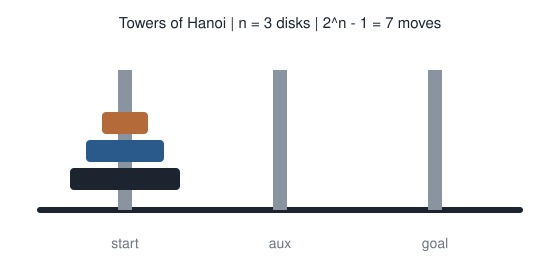
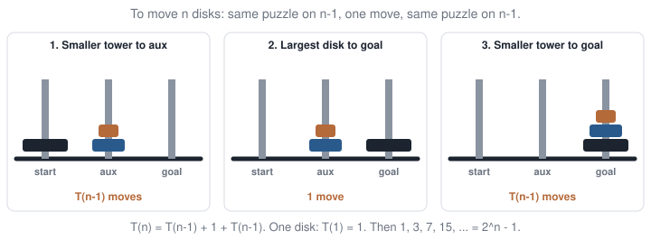
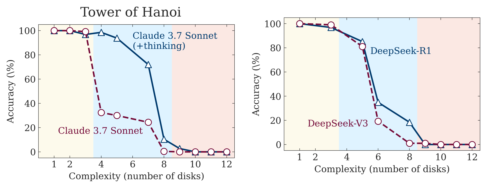
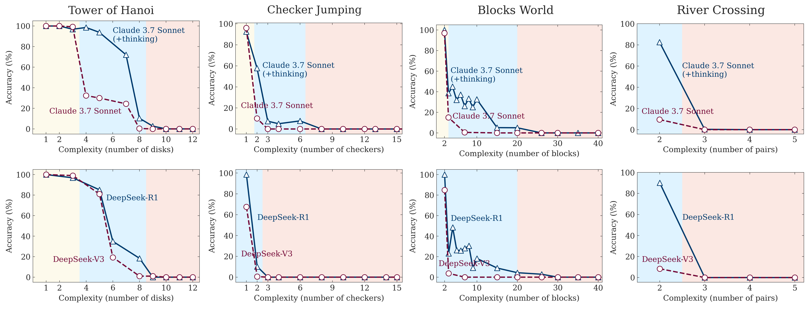
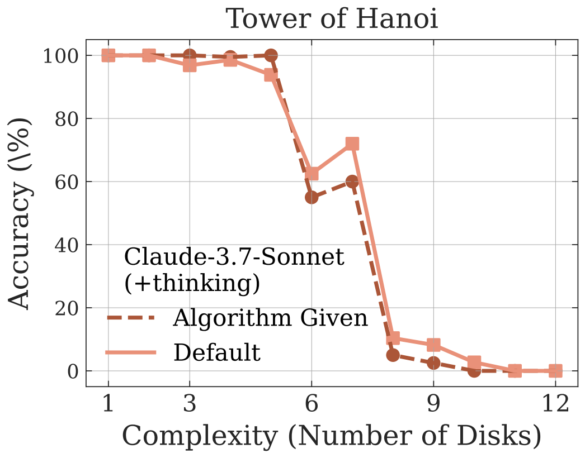
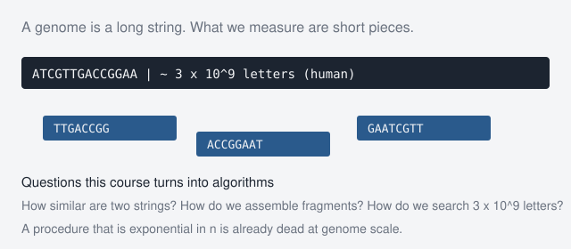
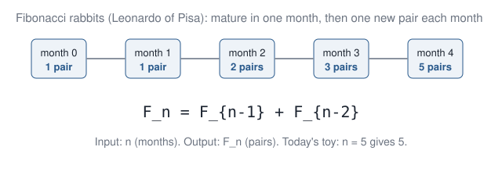
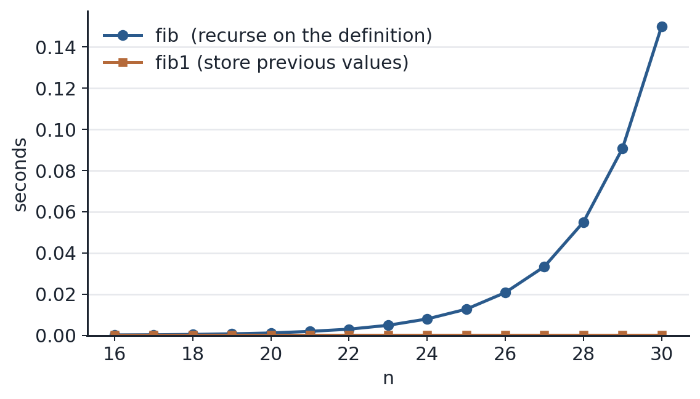
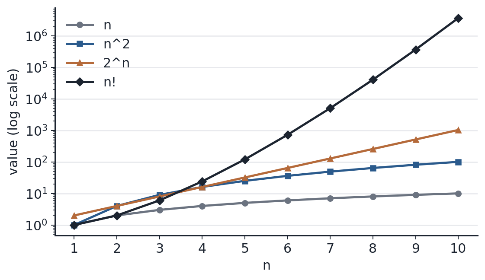

## This course

::: {.cards}
::: {.card}
**12 lectures**, 90 minutes each.

HS 2026: **14 September – 18 December**. Two calendar weeks are buffer. No 13th lecture.

Language: **English** (exam in English or German). Slides on **ILIAS**. Code is **Python**.
:::
::: {.card}
**Lab:** one Jupyter notebook each week. Open in **VS Code**: Select Kernel, then **Run All**.

Questions: [stephan.peischl@unibe.ch](mailto:stephan.peischl@unibe.ch) · D401, Baltzerstrasse 6

**Prerequisites:** basic math and some programming. Biology helps as context.
:::
:::


## Exam

::: {.cards}
::: {.card}
**Written, 2 hours**, closed book · date TBA

Sign up on **KSL** at least 14 days before.

You **outline an idea**. No code.
:::
::: {.card .warm}
Each lecture ends with three check questions.

**Q1–Q2** test today's idea.

**Q3** is a situation we did not practise.
:::
:::

If you can follow that week's lab notebook *and* answer Q3, you are in exam shape.

## Models can write the code. That is not the course.

A language model can emit a Fibonacci function, or a Hanoi solver, in seconds. That is not the same as **having an algorithm you can check**.

::: {.three-q}
Is it **correct** for every $n$?

What does it **cost** as $n$ grows — time, memory, and how long the output is?

Is there a **better** method?
:::

::: {.takeaway}
Generated code is a guess until you can answer those three questions. That is what this course trains.
:::

## A test of “reasoning”: Towers of Hanoi

:::: {.split .fig-left}
::: {.pane}
{.sketch}
:::
::: {.pane}
Rules: move one disk at a time; never put a larger disk on a smaller one.

The shortest solution for $n$ disks is not a long checklist. It is **the same puzzle, smaller**, twice, with one move in the middle.
:::
::::

## Hanoi $n=3$, live

Try to solve the puzzle for 3 disks on paper. Can you find a general way to solve this puzzle?

Hint: Watch for the pattern: a pile of two goes to the spare peg, the largest disk moves once, the pile of two comes back.


## Three jobs

To get $n$ disks to the goal: move the top $n-1$ **out of the way**, move the largest disk **once**, move the $n-1$ **on top**. Each “move $n-1$” is the same puzzle, one disk smaller.

{.sketch}

For $n=3$: 3 + 1 + 3 moves. The same three jobs work for any $n$.

## The recursive algorithm

Those three jobs, typed in. Same code as in the lab notebook.

```python
def hanoi(n, src, dst, aux):
    if n == 0:
        return
    hanoi(n - 1, src, aux, dst)   # smaller tower to aux
    print(src, "->", dst)          # largest disk once
    hanoi(n - 1, aux, dst, src)    # smaller tower to goal
```

`hanoi(3, "start", "goal", "aux")` prints **7** lines. The function body is three steps; the **printout** is what grows.

## The call tree for $n=3$

Each call does two smaller calls and one printed move. Unfold that for $n=3$:

{.sketch}

::: {.takeaway}
The algorithm text stays short. The tree of calls — and the list of moves — doubles with every extra disk: $T(n) = 2^n - 1$.
:::

## An iterative version

You can solve Hanoi **without recursion**. Same $2^n-1$ moves; a loop instead of a call stack.

**Rule (odd $n$).** Repeat until done:

1. Move the **smallest** disk one step in the cycle `start → goal → aux → start`.
2. Make the **only other legal move** (the move that does not touch the smallest disk).

For even $n$, reverse the cycle: `start → aux → goal → start`.

```python
# Pseudocode — same output length as the recursive version
for step in range(1, 2**n):          # 2^n - 1 moves
    if step % 2 == 1:
        move_smallest_along_cycle()
    else:
        make_only_other_legal_move()
```

::: {.takeaway}
Recursive or iterative: the **idea** can be short. Emitting every move still costs $2^n-1$ lines.
:::

## The list of moves is the expensive part

:::: {.split}
::: {.pane}
The algorithm is **tiny**: three jobs (or a short loop). The *list of moves* is $2^{n}-1$ lines.

Printing every move is a resource, like time and memory.
:::
::: {.pane}
| Disks $n$ | Moves $2^{n}-1$ |
|:-----------:|----------------:|
| 3 | 7 |
| 8 | 255 |
| 10 | $1{,}023$ |
| 20 | $\approx 10^6$ |
:::
::::

::: {.takeaway}
Describing the algorithm is not the same job as emitting every move. The list has its own cost.
:::

## Every legal board is a vertex

Each disk can sit on any of three pegs, with the size rule. That gives $3^n$ **legal boards**. Draw a vertex for each board and an edge for each legal one-disk move: for small $n$ the picture is a **Sierpiński triangle**.

{.sketch}

A shortest solution is a path of length $2^n-1$ from “all on start” to “all on goal.” The three-line recurrence *compresses* that path; you do not need to search the graph.

::: {.muted}
Week 7 draws Hanoi as a graph properly (nodes, edges, walks). Today: the state space is huge, fractal-shaped, and the recurrence already knows a shortest path.
:::

## Can LLMs reason?

Shojaee et al. (2025) asked frontier models for Hanoi **move lists** as $n$ grew. The same models could often **state** the three jobs — and still fail to carry them out.

{.paperfig .nostretch}

::: {.takeaway}
Accuracy is already gone by $n \approx 8$, where $2^{8}-1 = 255$ lines still fit. That is not “they ran out of words.”
:::

::: {.cite}
Shojaee et al., *The Illusion of Thinking*, Fig. 5 (Hanoi). [arXiv:2506.06941](https://arxiv.org/abs/2506.06941).
:::

## Collapse is not special to Hanoi

{.paperfig .nostretch}

::: {.takeaway}
Thinking models last a few extra steps. Then **everyone** is at zero — Hanoi, checkers, blocks, river crossing.
:::

::: {.cite}
Shojaee et al., Fig. 5. Shaded bands: low / medium / high complexity. [arXiv:2506.06941](https://arxiv.org/abs/2506.06941). *Huge* $n$ also hits output caps (Opus & Lawsen) — a different story.
:::

## Even given the algorithm

:::: {.split .fig-right}
::: {.pane}
Hanoi has an **exact** solution: the same three jobs, again.

They put that algorithm **in the prompt**. The model only had to execute the steps. Collapse still happens at the same $n$.

A language model does not *run* the three jobs. It *re-predicts* a plausible next board, move after move. One illegal move poisons the rest.
:::
::: {.pane}
{.paperfig .nostretch}
:::
::::

::: {.idea}
Name the problem first, then pick a method that actually carries out the steps.
:::


## What we will mean by algorithm

:::: {.split}
::: {.pane}
An **algorithm** is a finite list of well-defined instructions that starts from a given input, passes through a finite sequence of states, and **terminates** with an output.

Hanoi’s three jobs are an algorithm. A random mix of moves that might never finish is not.
:::
::: {.pane}
::: {.card .warm}
**Not a recipe**

1. Take ingredients.
2. Mix them in a random way.
3. Bake at a random temperature.
4. If the result is a cupcake: stop.
5. Else: go to 1.

Steps are not well-defined; it need not terminate.
:::
:::
::::

::: {.idea}
Three questions, every week: is it **correct**? what does it **cost** as a function of $n$ (time, memory, output length)? can we do **better**?
:::

## Input and output

Every algorithm in this course will be stated as:

::: {.io}
::: {.in}
**Input**

What you are given. Size measured by $n$ (and maybe $m$).
:::
::: {.arrow}
→
:::
::: {.out}
**Output**

What you must produce. A number, a path, a labelling, a tree.
:::
:::

If you cannot name input and output, you do not yet have a problem — only a vibe.

## Three questions, every week

We study **how algorithms work**: the idea, a worked example, what it costs.

::: {.three-q}
Is it **correct**?

What does it **cost** as a function of $n$? Time, memory, *and how long the answer is*.

Can we do **better**?
:::

Every meeting has a **lab notebook**: the lecture example, already filled in. Run it, change an input, watch the printout. We close with history, tools that use the idea, and a short reading list.

## Twelve weeks, in plain language

Biology gives us the data (strings, graphs, trees). This course is about **how to organise that data** so a method becomes feasible — not about memorising software menus.

| Weeks | What we do |
|--:|:---|
| **1–2** | Learn to judge a method (correct? $T(n)$? better?). Meet problems where listing every answer fails. |
| **3–6** | Find **similarity** between sequences (alignment as a filled table). Search smarter by **pruning** hopeless branches (motifs, branch-and-bound). Ask when a greedy step is good enough. |
| **7–9** | **Combine pieces** into one genome (assembly: change the graph). **Search** a long string without scanning it all (suffix trees, BWT / an index). |
| **10–12** | **Reconstruct hidden structure**: trees (phylogenetics), groups or axes (clustering / PCA), a classifying line (SVM). |

::: {.takeaway}
Change how the data are organised — a table, a tree of partial answers, a graph, an index — and the algorithm changes with them.
:::

Week-by-week titles live on ILIAS with the slides. We study algorithms, not software manuals.

::: notes
This is the map, not a syllabus reading. One breath per row. Naming BWT or assembly is a pointer, not a day-1 lecture.
:::

## Why size forces a choice

{.sketch}

A human genome is about $3 \times 10^9$ letters. Sequencing gives **short fragments**. Alignment, assembly, and search are procedures on strings of this size — that is weeks 4, 7, and 8–9, not a different subject.

All-vs-all character comparisons on that $n$ would be $n^2 \approx 9 \times 10^{18}$ operations. At a nanosecond each, that is not “a slow laptop” — it is **centuries**. Later we will change how the letters are organised (an index, a graph), not buy a faster CPU.

::: {.takeaway}
An exponential — or even quadratic — procedure is not “a bit slow”. At genome scale it does not finish. Change the algorithm, or change how the data are organised.
:::

## Today's toy example

::: {.goals}
1. State input, output, and the three questions.
2. Explain why naive recursive Fibonacci is exponential, and how storing results makes it linear.
3. Read Big-O off the loops in selection sort and bubble sort.
:::

::: {.toy}
**Toy.** $F_0=0$, $F_1=1$, $F_n = F_{n-1}+F_{n-2}$. Compute $F_5$ on paper, by unfolding the definition. (You should get $5$.)

Same idea as Hanoi: name the output, then pick a method that gives you the answer. At the end you will run two programs in Python and time them.
:::


## Fibonacci as a specification

{.sketch}

::: {.io}
::: {.in}
**Input**

An integer $n \ge 0$ (months, or just an index).
:::
::: {.arrow}
→
:::
::: {.out}
**Output**
The integer $F_n$.
:::
:::


## The obvious program

The recurrence, typed in:

```python
def fib(n):
    if n < 2:
        return n
    return fib(n - 2) + fib(n - 1)

fib(5)     # 5  — the toy
fib(10)    # 55
```

It matches the definition. For large $n$ it becomes unusable.

## Unfold $F_5$ on the board

Do **not** look at the next picture yet.

Write the call tree: $F_5$ calls $F_4$ and $F_3$. Keep going until $F_1$ and $F_0$.

**Vote:** how many times does $F_3$ appear?

::: notes
Hands up: once / twice / three times. Then show the SVG. The vote is the slide.
:::

## Three questions, on this program

::: {.three-q}
Is it **correct**?

How much **time** does it take, as a function of $n$?

Can we **do better**?
:::

## Is it correct?

::: {.three-q}
**Yes.** Each call returns $F_n = F_{n-1} + F_{n-2}$, with the right base cases.

How much **time** does it take, as a function of $n$?

Can we **do better**?
:::

## How much time?

Let $T(n)$ be the number of basic operations to compute $F_n$ with `fib`.

$$
T(n) = T(n-1) + T(n-2) + \Theta(1)
$$

::: {.fragment}
$T(n)$ grows at least as fast as $F_n$ itself.

$$
T(200) \ge F_{200} \ge 2^{138} \ge 10^{41}
$$
:::

::: {.fragment .muted}
Correct, and useless for large $n$. Same lesson as the genome: what matters is how the cost **grows**, not how fast the laptop is.
:::

## Why it explodes

The recursive program does not remember earlier answers. When it needs $F_3$ again, it rebuilds the whole subtree.

{.sketch}

In this tree for $F_5$: $F_3$ appears **twice**, $F_2$ **three** times, and $F_1$ **three** times. Same integers, computed again from scratch each time. That wasted work piles up, so the number of calls grows like $F_n$ itself — exponentially.

## Can we do better?

The explosion comes from **recomputation**: the same $F_k$ is asked for again and again. So keep each value once you have it.

On the toy: the call tree for $F_5$ makes **15** calls — you already saw $F_3$ appear twice. If we store answers as we go, we only need **five additions** and never recompute. Both methods still return the integer $5$.

::: {.idea}
Compute $F_1, F_2, \ldots, F_n$ once each, in order. Each step looks up the two previous values.
:::

## Store previous values

**How this works.** Keep only the last two Fibonacci numbers, `a` and `b`. Each loop step advances one index: the new pair is `(b, a+b)`. After $n-1$ steps, `b` is $F_n$. No tree, no recomputation — just a walk from $0$ to $n$.

```python
def fib1(n):
    if n < 2:
        return n
    a, b = 0, 1
    for _ in range(n - 1):
        a, b = b, a + b
    return b

fib1(5)    # same toy, linear work
```

## Two costs

::: {.small}
| Algorithm | Idea | Cost |
|:----------|:-----|:-----|
| `fib` | Recurse on the definition | $T(n) \approx 2^n$ |
| `fib1` | Remember previous values | $T(n) \approx n$ |
:::

::: {.takeaway}
Same input/output, two algorithms. The difference is an **idea** (reuse), not a faster computer.
:::

{.plot}

::: {.muted}
Measured on a linear axis. Recursive `fib` is already slow by $n \approx 30$. The stored-value version sits on the axis.
:::

## Performance is not complexity

::: {.cards}
::: {.card}
**Performance**

How long this run took, on this machine.
:::
::: {.card .warm}
**Complexity**

How the resource need **scales** as $n$ grows.
:::
:::

A faster laptop does not change $O(2^n)$ into $O(n)$. That was the genome slide, in one line.

## Big-O, informally

$O(f(n))$: for large $n$, the running time is bounded by a constant times $f(n)$.

$O(n^2)$ covers both $0.0005\,n^2$ and $10^7 n^2 + 3n + 2$.

::: {.takeaway}
Only the **leading term** matters. Constant factors do not.
:::

{.plot}

## Formally

$f(n)$ is $O(g(n))$ if there exist $c>0$ and $n_0$ such that $f(n) \le c\, g(n)$ for all $n > n_0$.

Claim: $6n^4 - 2n^3 + 5$ is $O(n^4)$. For $n \ge 1$:

$$
f(n) \le 6n^4 + 2n^3 + 5 \le 13 n^4.
$$

## Rules we will actually use

- Drop constants: $O(k\,f(n)) = O(f(n))$
- Drop slower terms: $O(n^2 + n^3) = O(n^3)$

::: {.small}
| Notation | Name |
|:---------|:-----|
| $O(1)$ | constant |
| $O(\log n)$ | logarithmic |
| $O(n)$ | linear |
| $O(n^2)$ | quadratic |
| $O(n^k)$ | polynomial |
| $O(k^n)$ | exponential |
:::

## Reading complexity off sorting

Same three questions, new output: a **sorted list**. We will not write a full sorter from scratch. We will read Big-O off the **loops that sorting uses**.

A **comparison** (`a[i] < a[j]`) or a **swap** of two entries is $O(1)$: one step, independent of $n$. Nested loops are where $n^2$ comes from.

To add costs: line up the pieces and keep the slowest. If a branch can exit early, quote the **worst** case — the input that makes the program do the most work.

## One pass of selection sort

Ninety seconds. Do not shout. Write Big-O on paper.

**What this does.** Walk the list once. Keep an index `m` of the smallest value seen so far. At the end, `m` points at the minimum of all $n$ items. That scan is the inner step of selection sort. Each comparison is $O(1)$.

```python
m = 0
for j in range(1, n):
    if a[j] < a[m]:    # O(1)
        m = j
```

::: {.fragment}
The loop runs about $n$ times. Cost $O(n)$. One pass. Selection sort uses this to find the next item to place.
:::

## Selection sort: nested scans

**How the algorithm works.** Grow a sorted prefix from the left. For each position $i$, scan the unused suffix $a[i],\ldots,a[n-1]$, find its minimum, and **swap** that minimum into position $i$. Then $i$ moves one step right. After $n$ such placements, the whole list is sorted.

```python
for i in range(n):
    m = i
    for j in range(i, n):
        if a[j] < a[m]:          # O(1) comparison
            m = j
    a[i], a[m] = a[m], a[i]      # O(1) swap
```

::: {.fragment}
Outer loop: $n$ positions. Inner loop: up to $n$ comparisons each. About $n^2/2$ comparisons in total — that is $O(n^2)$. Drop the constant. Bubble sort and insertion sort use the same nested shape.
:::

## Bubble sort: worst case, not the lucky pass

**How the algorithm works.** Repeatedly walk neighbouring pairs. Whenever two neighbours are out of order, swap them. One full walk is a **pass**. Large values “bubble” toward the end. If a pass makes **no** swap, the list is already sorted and we can stop. We still quote the **worst** case for Big-O.

```python
swapped = True
while swapped:                   # at most n passes
    swapped = False
    for i in range(n - 1):
        if a[i] > a[i + 1]:      # O(1)
            a[i], a[i + 1] = a[i + 1], a[i]
            swapped = True
```

::: {.fragment}
Already sorted: one pass, $O(n)$. Reverse sorted: about $n$ passes, $O(n^2)$. Big-O is the worst case, not the average over lucky inputs.
:::

## Those loops, as a picture

Same input, several methods. Selection and bubble are the nested $O(n^2)$ scans you just read. Merge sort and quicksort **split** the list and combine the pieces — that is where $O(n\log n)$ comes from. Watch them move.

<video data-autoplay loop muted controls>
<source src="img/sorting-algos.mp4" type="video/mp4">
</video>

::: {.muted}
More starting orders: [Toptal, Sorting Algorithms](https://www.toptal.com/developers/sorting-algorithms).
:::

## A few sorting methods

::: {.small}
| Method | Idea | Typical | Worst case |
|:-------|:-----|:--------|:-----------|
| Insertion, selection, bubble | Scan for the next item, or swap neighbours | $O(n^2)$ | $O(n^2)$ |
| Merge sort, heap sort | Split, sort halves, merge — or use a heap | $O(n\log n)$ | $O(n\log n)$ |
| Quicksort | Pick a pivot; recurse on the two sides | $O(n\log n)$ | $O(n^2)$ |
:::

Same output, different ideas, different growth — the same lesson as the two Fibonacci programs.

## Back to the two Fibonaccis

The recursion tree has at most $1+2+4+\cdots+2^{n-1}$ nodes.

$$
T_{\texttt{fib}}(n) = O(2^n), \qquad T_{\texttt{fib1}}(n) = O(n)
$$

::: {.takeaway}
Same output as the toy $F_5$. Storing values turns exponential work into linear work.
:::

## Recursion is not the explosion

One last comparison before the lab. $n! = 1 \cdot 2 \cdots n$. Same output, two programs:

```python
def fact(n):                 # n * (n-1)!
    if n <= 1:
        return 1
    return n * fact(n - 1)   # one call

def fact1(n):                # 1*2*...*n
    p = 1
    for k in range(1, n + 1):
        p *= k
    return p
```

`fact` calls itself **once**. The calls are a chain of length $n$, not a binary tree.

::: {.takeaway}
`fib` is exponential because each call splits in **two**. Recursion itself is not the cost.
:::

::: notes
If someone says “recursion is slow”, this is the correction. Count the arrows out of a call.
:::

## 90 seconds: factorial vs Fib

Pair up. How many recursive calls does `fact(5)` make? How many does `fib(5)` make?

::: {.fragment}
`fact(5)` is a chain of length 5. `fib(5)` is a tree. The wrap will ask this again as Q3.

The number of recursive *branches* is what matters, not the word recursion. That is how you recognise when an approach will work.
:::

## Open `labs/01-fib.ipynb`

::: {.lab}
::: {.lab-tag}
Lab · ~15 minutes · Python
:::

The toy is still $F_5 = 5$. Run All — both programs are already in the notebook.

1. Confirm `fib(5) == 5` and `fib1(5) == 5`.
2. Time `fib` vs `fib1` for $n = 5,10,15,20,25$. Do not start at $n=40$.
3. Why is `fib(25)` slower if both return the same integer?
4. `fact` vs `fact1` for $n!$: why is the recursive one not exponential?
5. Optional: `hanoi(3)` prints 7 lines. The algorithm is three lines; $n=20$ would print about a million. Output length is a resource.
:::

The code already runs. The questions are yours to answer.

## A bit of history

::: {.history}
- **al-Khwarizmi** (9th c.): the word *algorithm*. A finite, transmissible procedure.
- **Fibonacci**, *Liber Abaci* (1202): the rabbit recurrence. The algorithm is not the story.
- **Bellman** (1950s) will name what `fib1` is doing — fill a table of overlapping subproblems, later called dynamic programming (week 3).
- **Knuth**, *The Art of Computer Programming*: analysis of recurrences as a subject.
:::

## Tools that use this idea


::: {.tools}
- Every compiler and interpreter: you ask the same three questions of generated code — including code from a language model.
- Genome-scale tools exist because someone changed the *idea*, not the laptop. **BLAST** (week 3) indexes short words, then extends a local match. **minimap2** and **BWA** (weeks 8–9) index the genome so a query does not scan all $3 \times 10^9$ letters. **IQ-TREE** (week 10) scores trees by pruning, not by unfolding an exponential recurrence.
- [Python Tutor](https://pythontutor.com) — watch `fib(5)` allocate a tree of calls.
:::

## Extensions

::: {.ext}
- **Memoization.** Keep the recursive definition of `fib`, but store every answer in a dictionary the first time you compute it. The next call with the same $n$ returns the stored value. Still $O(n)$ time (each $F_k$ once), but the recursion depth can grow with $n$, so the call stack can overflow for large $n$. `fib1` avoids that by using a loop.
- **Matrix exponentiation.** There is a $2\times 2$ matrix whose powers produce Fibonacci numbers. Raising that matrix to the $n$-th power needs only $O(\log n)$ matrix multiplications. Same output $F_n$, a third algorithm — faster asymptotically than `fib1`, but we will not need it this course.
- Recurrences in biology: branching processes; the number of histories on a tree (week 10) is not Fibonacci, but it is the same *kind* of count. Storing those histories as shared edges is a change of layout, not a new recurrence.
:::

::: notes
5–8 minutes. If the room is tired, history + tools only. Extensions are a pointer.
:::

## What you must be able to say

::: {.muted}
Without notes. **Q1–Q2** check today’s idea. **Q3** is a situation we did not practise.
:::

::: {.qs}
::: {.q}
[Q1]{.tag} Why is `fib(25)` slower than `fib1(25)` if both return the same integer?
:::
::: {.q}
[Q2]{.tag} What is $T(n)$ for each, in Big-O?
:::
::: {.q .q3}
[Q3]{.tag} $n! = 1\cdot 2\cdots n$. Recurrence: $n\cdot(n-1)!$, one call. Why is `fact` $O(n)$, like the loop, not $O(2^n)$ like `fib`?
:::
:::

::: {.takeaway}
Q3 is a question we did not practise. Replaying today’s toy is not enough.
:::

::: notes
Walk the room. Pair-share Q3. Do not fill it in for them.
:::

## Takeaways

::: {.takeaway}
Name the input and the output. Then ask: is it correct? what is $T(n)$? can we do better? Count **output length** as a resource too.
:::

::: {.takeaway}
Naive Fibonacci recomputes the same values many times. Storing values turns $O(2^n)$ into $O(n)$.
:::

::: {.takeaway}
Hanoi has three exact steps. Printing the list of moves is a different resource. Asking a language model for that list is the wrong tool — a guess at every move, not those three steps. At genome scale, **how the work grows** is what counts.
:::

## Next week

**Hard problems and greedy ideas.** Same three questions; the object is a map of cities, not a recurrence.

Toy: four cities. How many tours? A greedy hop to the nearest city — is it shortest?

## To read

::: {.read}
- Shojaee et al. (2025). *The Illusion of Thinking*. [arXiv:2506.06941](https://arxiv.org/abs/2506.06941). Comment: [Opus & Lawsen](https://arxiv.org/abs/2506.09250).
- Dasgupta, Papadimitriou, Vazirani. *Algorithms* — free PDF, ch. 0–2. [Berkeley page](https://people.eecs.berkeley.edu/~vazirani/algorithms.html).
- Cormen, Leiserson, Rivest, Stein. *Introduction to Algorithms* — Big-O as used in this course.
- Step through `fib` in [Python Tutor](https://pythontutor.com).
- Sorting animations: [Toptal](https://www.toptal.com/developers/sorting-algorithms).
:::
