## Recap

Last week’s three questions: is it **correct**? what is $T(n)$? can we do **better**?

Same integer $F_n$, two algorithms: naive recursion $O(2^n)$, store previous values $O(n)$. Growth, not the laptop.

We also met a human genome: about $3 \times 10^9$ letters. Quadratic comparison already does not finish. Alignment, assembly, and search are procedures on **that** $n$.

::: {.takeaway}
Today we look at **TSP**: a classic problem that is hard and often turns up in disguise — for example in genome assembly.
:::

::: notes
5 minutes. Point at last week’s genome slide. Then: what the lab actually returns.
:::

## Labwork doesn't give you a chromosome

You want one sequence: a pathogen in an outbreak, a tumour, a new isolate, a reference to call variants against.

What you hold is a **bag of short reads** — typically a few hundred letters each, millions of them. Until those pieces are ordered, you cannot read a gene or compare two genomes.

{.sketch}

Last week this picture was “the string is huge.” Today the bar at the top is **unknown**. The coloured pieces are what was measured.

## Shotgun sequencing

DNA is sheared. The machine reads the fragments, not the intact chromosome.

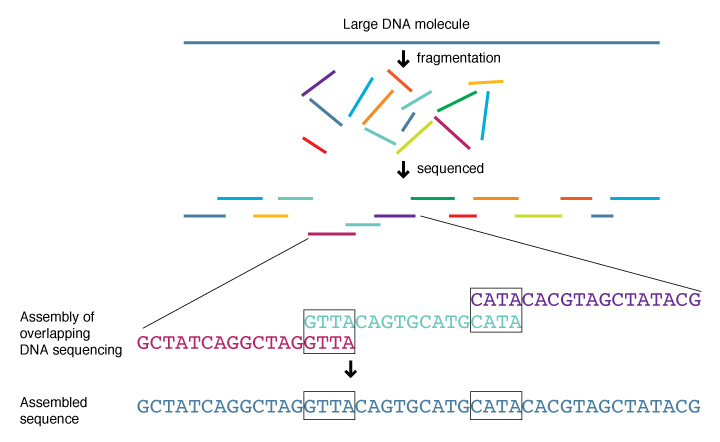{.photo}

::: {.cite}
Shotgun sequencing. National Human Genome Research Institute, Wikimedia Commons, public domain. File: Shotgun sequencing lg.jpg.
:::

The fragments **overlap**. Reconstruction means putting them in an order so neighbours agree on the letters they share.

## What the data look like

An unknown genome; four reads that tile it. Neighbours share a suffix–prefix. A wrong order leaves a gap.

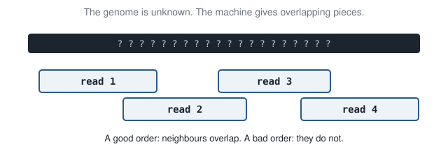{.sketch}

::: {.takeaway}
Input: a set of overlapping reads. Output: an order that rebuilds one string. That is the biological problem.
:::

## A tiny genome: `ACAAT`

Suppose the hidden string is `ACAAT`. The machine might return `ACA`, `CAA`, `AAT`.

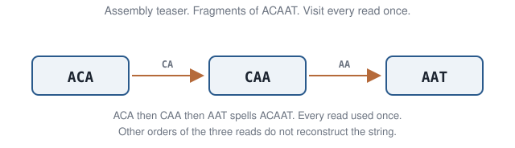{.sketch}

`ACA` then `CAA` share `CA`. `CAA` then `AAT` share `AA`. That path visits every read **once** and spells `ACAAT`.

::: notes
Do not build a de Bruijn graph today. Count orders next. The picture is: we want an order of the reads.
:::

## Six orders, one genome

Three reads can be lined up in $3! = 6$ orders. Only `ACA → CAA → AAT` reconstructs `ACAAT`. The other five disagree on the overlap.

| Order | Overlaps? |
|:------|:----------|
| `ACA`, `CAA`, `AAT` | yes — spells `ACAAT` |
| `ACA`, `AAT`, `CAA` | no |
| `CAA`, `ACA`, `AAT` | no |
| … three more … | no |

For $n$ reads there are $n!$ orders (before symmetries). Most are wrong. Choosing the order is the algorithm — not a laboratory step.

## Greedy assembly of reads

A natural rule: start at a read, then always glue the unused neighbour with the **largest overlap**.

On the toy: from `ACA`, `CAA` shares two letters, `AAT` shares one. Greedy takes `CAA`, then `AAT`. Lucky — that is the true string.

That rule is **nearest neighbor**. It will fail on a bigger map. Today we need numbers we can add, so we rename the objects.

## Travelling salesman problem

Visiting every **read** once is the same puzzle as visiting every **city** once and returning home.

::: {.cards}
::: {.card}
**Assembly**

Reads. Distance = how badly they overlap (or $1/$ overlap). A path through every read rebuilds the genome.
:::
::: {.card .warm}
**A map**

Cities. Distance = kilometres (or the lab matrix). A **tour** visits every city and returns home.
:::
:::

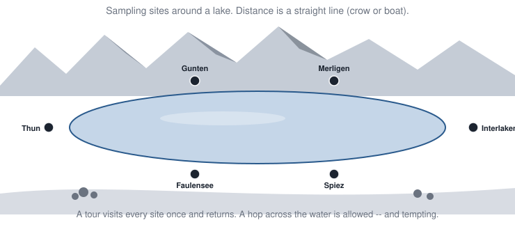{.sketch}

::: {.io}
::: {.in}
**Input**

$n$ cities and a symmetric matrix of pairwise distances.
:::
::: {.arrow}
→
:::
::: {.out}
**Output**

A cyclic order of the $n$ cities (a tour) of minimum total length.
:::
:::

TSP adds “return home.” The explosion is the same: the number of orders is factorial. Week 7 changes how assemblers draw the graph; today the working object is four cities and a distance matrix.

## The idea

::: {.idea}
Exhaustive search is a method, not a solution: listing every tour of $n$ cities is $O(n!)$. A greedy step is locally best and may be globally wrong — unless you can prove it. For some problems, a good approximation is the right goal.
:::

::: {.goals}
By the end of this meeting you should be able to:

1. Count TSP tours, list them on $n=4$, and score them.
2. Build a nearest-neighbor tour from **two different starting cities**, then try to improve one tour by **swapping two edges** (2-opt).
3. Run a genetic algorithm on tours (with parameters you can change), and earliest-finish on intervals.
:::

## The same tour, many labels

TSP is rarely advertised as “cities.” Anything that must **visit every object once and return** (or almost) is this problem.

::: {.cards}
::: {.card}
**Biology**

Order overlapping **reads** (today). Order DNA probes on a chip. A robot spotting samples on a microarray.
:::
::: {.card .warm}
**Elsewhere**

Drill every hole on a circuit board. Deliver to every address. Point a telescope at every target. A milling tool that must visit every cut.
:::
:::

The cities change; the factorial count does not. If you can name the objects and the cost of going from one to the next, you have TSP — often in disguise.

::: {.takeaway}
Recognise the tour, then pick a method. Do not wait for someone to say “travelling salesman.”
:::

## How many tours?

For $n$ cities there are

$$
\frac{(n-1)!}{2}
$$

distinct tours: direction does not matter, and the starting city is only a rotation of the same cycle.

## Four cities

:::: {.split .fig-right}
::: {.pane}
A tour is a cycle. Starting at $B$ on

$A \to B \to C \to D \to A$

is still that tour. Walking it backwards,

$A \to D \to C \to B \to A$,

is the same tour. That is why we count $(n-1)!/2$.

::: {.fragment}
Five cities: $4!/2 = 12$. Ten: $181\,440$. Twenty: about $6 \times 10^{16}$.
:::
:::
::: {.pane}
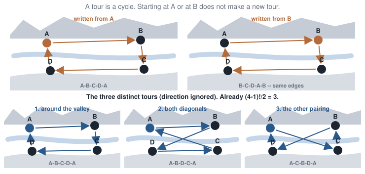{.sketch}
:::
::::

## Why $(n-1)!/2$?

:::: {.split}
::: {.pane}
Fix a start, say $A$. The other $n-1$ cities can be ordered in $(n-1)!$ ways. Walking a cycle backwards is the same tour, so divide by $2$.

| $n$ | Distinct tours |
|--:|--:|
| 3 | $2!/2 = 1$ |
| 4 | $3!/2 = 3$ |
| 5 | $4!/2 = 12$ |
| 6 | $5!/2 = 60$ |
:::
::: {.pane}
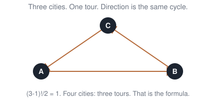{.sketch}

Draw $n=3$: only one triangle. $(3-1)!/2 = 1$. Four cities: three tours. That is the formula, not a mystery.
:::
::::

::: notes
Write $n=3$ on the board: only one triangle. Then $n=4$: three ways to pick the two diagonals vs the square.
:::

## Three tours, scored

The numbers in the lab matrix are pairwise costs, **not** distances on a geographic map. Add the four edges of each cycle.

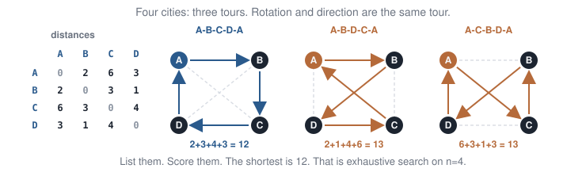{.sketch}

::: notes
8 minutes. Cover the lengths. Have them add $2+3+4+3$ before you reveal 12.
:::

## Exhaustive search

**Method:** generate every tour, keep the shortest.

```python
best = float("inf")
for tour in all_tours(cities):
    length = tour_length(tour, dist)
    if length < best:
        best = length
```

Correct. Cost: $\Theta(n!)$ tours, each $O(n)$ to score.

::: {.takeaway}
`fib` was exponential. Exhaustive TSP is **factorial** — worse. Listing every order of $n$ reads is the same count.
:::

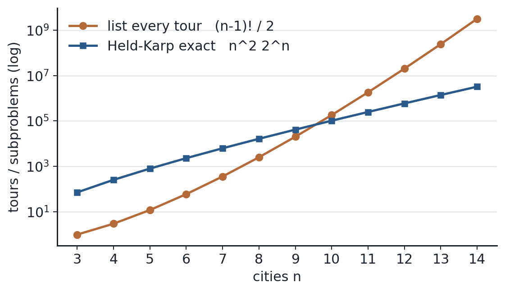{.plot}

## How far does exact search go?

| $n$ | Tours $(n-1)!/2$ | Roughly |
|--:|--:|:--|
| 5 | 12 | instant |
| 10 | $1.8 \times 10^5$ | a second |
| 12 | $2.0 \times 10^7$ | a minute |
| 15 | $4.4 \times 10^{10}$ | not today |
| 20 | $6 \times 10^{16}$ | no |

A better exact method (Held–Karp, next slide) improves this to $O(n^2 2^n)$ — still exponential. Twenty cities is already hopeless for exact search in class.

## Exact TSP can reuse overlapping paths

Held–Karp (1962) does **not** list every tour. It fills a table.

**What one cell means.** Fix a start city $A$. A cell stores the length of the **best path** that

- started at $A$,
- visited exactly the cities in a set $S$,
- and **ended** at a particular city $i \in S$.

When you grow $S$, you reuse the answers already stored for smaller sets — the same diagnosis as Fibonacci.

{.sketch}

::: {.idea}
That method — fill a table of overlapping subproblems — is **dynamic programming**. It is the topic of **next week**.
:::

::: {.takeaway}
About $n \cdot 2^n$ cells, not $n!$ tours. For $n=20$: roughly $20 \cdot 10^6$ cells vs $6 \times 10^{16}$ tours — better, still not something we fill by hand.
:::

## Some problems stay expensive

Last week: two algorithms, two costs, **same problem**.

Some problems are expensive **no matter how clever the algorithm**. Listing all subsets of an $n$-element set is $O(2^n)$: the output is that large.

::: {.fragment}
TSP is in a class of problems (NP-complete) for which **no polynomial algorithm is known**, and none may exist.
:::

::: notes
Do not define NP, reductions, or certificates. “No known poly-time exact algorithm; exact search does not scale.”
:::

## Exact is not always the goal

::: {.three-q}
Is exhaustive TSP **correct**? Yes — if it finishes.

How much **time**? $O(n!)$ — it will not finish.

Can we **do better**? Better *exact* methods exist and are still exponential. We can also accept **approximate** tours.
:::

::: {.takeaway}
A fast answer that is a bit long can beat a perfect answer that never arrives.
:::

## A greedy tour

1. Start at a city.
2. Go to the **closest unvisited** city.
3. Repeat until every city is visited; return home.

```python
def nn_tour(dist, start):
    n = len(dist)
    visited = [start]
    now = start
    for _ in range(n - 1):
        cand = [i for i in range(n) if i not in visited]
        now = min(cand, key=lambda j: dist[now][j])
        visited.append(now)
    return visited
```

::: notes
25 minutes. Draw 5 points. Run NN from two different starts. The tours differ; neither need be optimal.
:::

## Nearest neighbor on the toy

Always the closest unused city. Same lab matrix as before. On reads, this was “glue the largest unused overlap.”

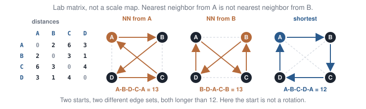{.sketch}

::: {.fragment}
**Start at $A$:** $A \to B$ ($2$), $B \to D$ ($1$), $D \to C$ ($4$), home $C \to A$ ($6$). Tour $A$-$B$-$D$-$C$-$A$, length **$13$**.

**Start at $B$:** $B \to D$ ($1$), $D \to A$ ($3$), $A \to C$ ($6$), home $C \to B$ ($3$). Tour $B$-$D$-$A$-$C$-$B$, length **$13$**.

Same length, **different edges** (not a rotation of the same cycle). The shortest listed tour is still **$12$**, so nearest neighbor missed the optimum either way.
:::

## Cost of nearest neighbor

At step $k$ you scan the $n-k$ unused cities for the nearest.

$$
T(n) = (n-1) + (n-2) + \cdots + 1 = O(n^2)
$$

| Method | Exact? | Cost |
|:-------|:-------|:-----|
| Exhaustive | yes | $O(n!)$ |
| Nearest neighbor | no | $O(n^2)$ |

## How good is it?

On random points in the plane, nearest neighbor is on average about **25% longer** than optimal (Johnson & McGeoch). That average hides ugly maps.

Six sampling sites around a long lake. Distance is a **straight line** (a crow, a boat). From Gunten, which unused site is closest?

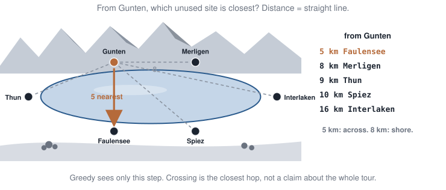{.sketch}

## The leftover hop

Nearest neighbor takes that 5 km crossing, then walks on, and is left with Interlaken–Thun down the length of the lake.

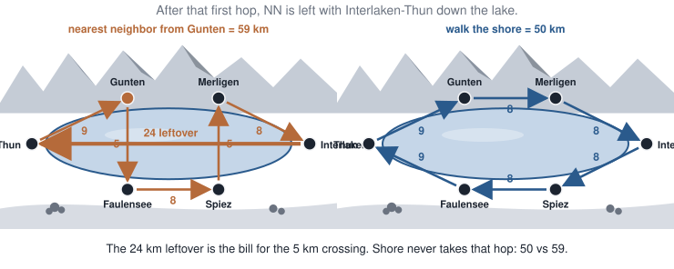{.sketch}

::: {.takeaway}
Greedy is $O(n^2)$ and useful. A locally nearest hop can be a globally stupid tour. Saving 5 km on one hop does not make a short tour — and the largest overlap need not assemble the genome.
:::

## Why uncross? 2-opt

Nearest neighbor is a **first guess**: a legal tour, built quickly. On the lab matrix it gave length $13$, but we already listed a tour of length $12$. So the guess can be improved without starting over.

**Idea.** Keep the same cities. Try a small change: drop two edges, reconnect their four endpoints the other way. If the new tour is shorter, keep the swap. That is **2-opt**.

On the toy, NN from $A$ uses the two **diagonals**. Swap them for the two sides of the square: length $13$ becomes $12$.

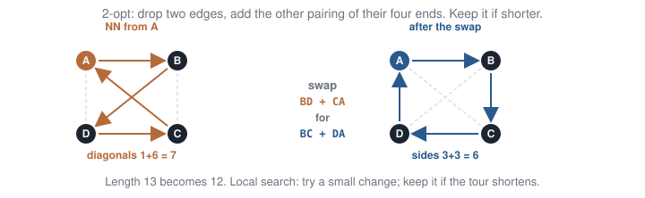{.sketch}

::: {.takeaway}
Use NN (or any construction) as a starting tour, then search for improving swaps. Still no proof you have the shortest tour — only that this change helped.
:::

::: notes
8 minutes. Point at BD and CA (1+6=7) vs BC and DA (3+3=6). Lab: NN from A, then this swap.
:::

## Local search, not a guarantee

2-opt found the optimum on $n=4$. That is luck of a tiny instance.

::: {.takeaway}
Local search is another *method for a good answer*. It still has no proof it is shortest, unless you check every tour.
:::

In practice people run 2-opt (or 3-opt) after nearest neighbor. A genetic algorithm is another method, with an explicit representation: a tour is a permutation.

## A genetic algorithm

A **population** of tours. Fitness = shortness (shorter is better). Make children; keep the short ones. Repeat for several generations.

1. **Select** two parents (prefer short tours).
2. **Crossover** that respects permutations — **order crossover**: copy a block from one parent; fill the rest in the other parent’s order, skipping cities already used.
3. **Mutate** (swap two cities, or reverse a segment — a random 2-opt).

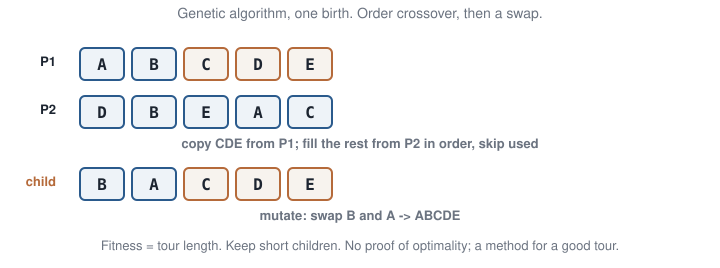{.sketch}

You choose the **parameters**: population size, number of generations, mutation rate. Different choices, different tours.

## What the algorithm is — and is not

::: {.takeaway}
A genetic algorithm is a randomised search on a *population* of tours. It is not a model of evolution, and it has no optimality proof.
:::

**Ant colony**, in one sentence: the same loop, but the object being mixed is **pheromone on edges**, not permutations of cities.

**Simulated annealing:** one tour; sometimes accept a worse swap so you can leave a local minimum.

## Open the notebook: genetic algorithm

::: {.lab}
::: {.lab-tag}
Lab break · genetic algorithm · Python
:::

Open `labs/02-tsp.ipynb`. Go to the **genetic algorithm** section (15 cities in the plane).

1. Run it. Press ▶ on the **animation** of the best tour (length curve beside it).
2. Change `POP_SIZE`, `GENERATIONS`, `MUTATION_RATE`, or `N_CITIES`. Run again.
3. Compare the final length to nearest neighbor (dashed line on the plot).
:::

Play with the knobs. The lecture continues with a different greedy problem — one where the local rule **is** exact.

## Methods that finish — a summary

| Method | What it does | Exact? |
|:-------|:-------------|:-------|
| Nearest neighbor | Always the closest unused city | No |
| 2-opt | Uncross two edges if the tour shortens | No |
| Genetic algorithm | Population of tours; crossover + mutate | No |
| Ant colony / annealing | Same loop, different representation | No |

We list $n=4$ so you can see the method. None of these hops replaces listing tours if you need a proof.

::: {.takeaway}
Listing tours is exact and may never finish. A hop (NN, GA, 2-opt) can be wrong — and can still be the right tool when $n$ is large.
:::

## Greedy can also be exact {.section-head}

TSP greedy can be wrong. That does not mean greedy is a bad idea. For some problems, the local rule **is** a proof.

## Interval scheduling

**The problem.** One seminar room. Each talk has a start time and a finish time. Two talks cannot overlap; a talk **may start** when the previous one finishes. You want **as many talks as possible** — not the longest total time, the largest *count*.

A sequencing instrument that runs one library at a time is the same problem: start–finish windows, one machine.

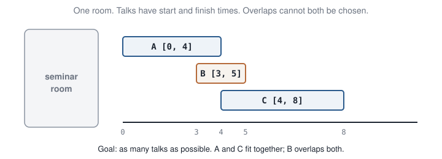{.sketch}

## Input / output

::: {.io}
::: {.in}
**Input**

A list of talks. Each talk has a start time and a finish time.
:::
::: {.arrow}
→
:::
::: {.out}
**Output**

A largest set of talks with no two overlapping.
:::
:::

On the toy: three talks, times in hours from noon. $A$ is $[0,4]$, $B$ is $[3,5]$, $C$ is $[4,8]$.

## Earliest finish

Always take the remaining talk that **finishes first**. Delete anything that overlaps it. Repeat.

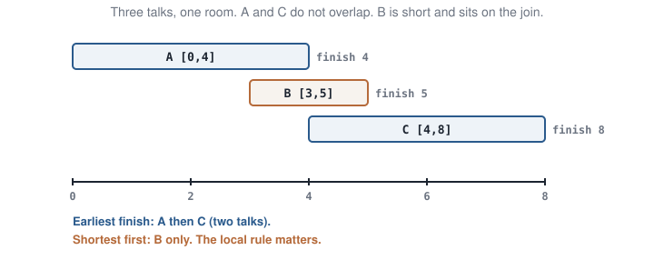{.sketch}

::: notes
10 minutes. Cover the bottom line. Vote: shortest first vs earliest finish.
:::

## The local rule matters

**Shortest talk first** takes $B$ (duration 2) and then nothing else overlaps. One talk.

**Earliest finish** takes $A$ (finishes at 4), then $C$ (starts at 4). Two talks.

::: {.takeaway}
Same idea (greedy), two rules. For this problem, earliest finish is **always** a largest set. Shortest first is not. For TSP, nearest neighbor is greedy and can be wrong.
:::

## Why earliest finish works

**Exchange idea.** Suppose some optimal schedule $O$ disagrees with earliest-finish. Look at the first place they differ.

Earliest-finish picked talk $A$, which finishes as early as possible among remaining talks. Any optimal schedule must pick *some* talk that overlaps the early part of the day; that talk finishes **no earlier** than $A$.

Swap: replace that talk in $O$ by $A$. The rest of $O$ still fits, because $A$ freed the room at least as soon. So there is an optimal schedule that agrees with earliest-finish on this choice. Repeat.

::: {.takeaway}
On the toy: earliest-finish takes $A$ (done at 4), then $C$ — two talks. If you take $B$ instead, $B$ occupies $[3,5]$ and blocks both $A$ and $C$ — only one talk. Finishing early never blocks a larger set afterwards.
:::

## Open the notebook: interval scheduling

::: {.lab}
::: {.lab-tag}
Lab · interval scheduling · Python
:::

Still in `labs/02-tsp.ipynb`. Go to the **interval scheduling** section.

Both rules are already coded: `earliest_finish` and `shortest_first`. Pass any list of `(name, start, finish)` intervals.

1. Run both on the lecture toy $A,B,C$.
2. Run both on the **Q3 table** (hours $9$–$18$) in the notebook.
3. Optional: invent your own list. Which rule keeps more talks?
:::

Do not look for Q3 answers yet — they are at the end of the slide deck.

## Exhaustive vs greedy

::: {.takeaway}
Exhaustive methods can return a correct optimum and may never finish. Greedy methods finish and may return a suboptimal answer — unless you have a proof for that rule (interval scheduling) or accept approximation (TSP).
:::

Next week adds a third option: dynamic programming — still exact, much less work than listing everything, when subproblems overlap.

## A bit of history

::: {.history}
- **Menger** (1930s): the “messenger problem” — visit cities, return, minimise distance.
- **Dantzig, Fulkerson, Johnson** (1954): 49 US cities, cutting planes. Exact TSP becomes a research field.
- **Held & Karp** (1962): DP in $O(n^2 2^n)$. Still exponential; the one exact method worth naming.
- **Karp** (1972): Hamiltonian cycle is NP-complete. No known polynomial algorithm; none may exist.
- **Holland** (1975): genetic algorithms. A TSP tour is a permutation; order crossover is the later standard encoding.
:::

## Tools that use this

::: {.tools}
- Routing libraries (Google **OR-Tools**, **LKH**): tours and local search, not genomes.
- **Overlap-layout-consensus** assemblers (classical Celera, Canu for long reads): the layout step **visits every read once** — today’s tour. Week 7 will draw this as a different graph.
- Circuit-board drilling and genome-probe ordering: the same tour, different labels.
:::

## Extensions

::: {.ext}
- **3-opt:** the same uncross, three edges at a time. The usual way NN is improved in practice after 2-opt.
- Week 5 will put exhaustive TSP back as a **search tree** with a bound.
- Interval scheduling is Kleinberg–Tardos, ch. 4 — the exchange argument we sketched.
:::

::: notes
After the lab. Do not start NP reductions.
:::

## What you must be able to say

::: {.qs}
::: {.q}
[Q1]{.tag} How many distinct TSP tours on $n$ cities, and why is that not $n!$?
:::
::: {.q}
[Q2]{.tag} Nearest neighbor from two starts can disagree, and neither need be shortest. Say that on the toy.
:::
::: {.q .q3}
[Q3]{.tag} One room. As many talks as possible; two talks cannot overlap. A talk may start when the previous one finishes.

::: {.small}
| Talk | Start | Finish |
|:-----|:------|:-------|
| $A$ | 09:00 | 13:00 |
| $B$ | 12:00 | 14:00 |
| $C$ | 13:00 | 17:00 |
| $D$ | 17:00 | 18:00 |
:::

(a) Listing every subset: how many subsets of 4 talks? Does that method give a largest possible set?

(b) Repeatedly take the remaining talk that **finishes first**. Which talks?

(c) Repeatedly take the remaining **shortest** talk that still fits. Which talks?

(d) Which of (a)–(c) is guaranteed a largest set? Which can return too few?
:::
:::

::: {.takeaway}
Leave Q3 open for now. In the lab notebook, both greedy rules are implemented — run them on this table and decide. Answers are at the **end** of these slides.
:::

::: notes
Do not reveal answers yet. Point them at the interval section of labs/02-tsp.ipynb.
:::

## Takeaways

::: {.takeaway}
$n!$ grows faster than $2^n$. Exhaustive TSP does not scale — neither does listing every order of $n$ reads.
:::

::: {.takeaway}
Nearest neighbor: always the closest unused city (always the largest unused overlap). $O(n^2)$, start-dependent, not always optimal. 2-opt can uncross; it still does not prove optimality.
:::

::: {.takeaway}
Earliest-finish on intervals *is* optimal. Greedy is a method; the rule needs a proof or a counterexample.
:::

## Next week

**Dynamic programming — the idea.**

A tourist on a grid may only walk south and east. Listing every path is hopeless. The same cell is reached by many paths — so we will **fill a table** instead of recomputing.

## To read

::: {.read}
- Held & Karp (1962). A dynamic program for TSP, $O(n^2 2^n)$.
- Karp (1972). Reducibility among combinatorial problems — Hamiltonian cycle.
- Holland (1975): genetic algorithms; order crossover for permutations.
- Watch a tour grow: [TSP demo (Google OR-Tools)](https://developers.google.com/optimization/routing/tsp).
:::

## Q3 answers

After you have tried both rules in the lab.

::: {.small}
| Talk | Start | Finish | Duration |
|:-----|:------|:-------|:---------|
| $A$ | 09:00 | 13:00 | 4 h |
| $B$ | 12:00 | 14:00 | 2 h |
| $C$ | 13:00 | 17:00 | 4 h |
| $D$ | 17:00 | 18:00 | 1 h |
:::

**(a)** There are $2^4 = 16$ subsets. Checking every feasible subset and keeping the largest **is** exact — it finds a largest possible set. Cost grows as $2^n$ talks.

**(b) Earliest finish:** sort by finish time $A,B,C,D$. Take $A$ (ends 13:00), skip $B$ (overlaps), take $C$ (starts 13:00), take $D$ (starts 17:00). Talks: **$A$, $C$, $D$** (three).

**(c) Shortest first:** sort by duration $D$ (1 h), $B$ (2 h), then $A$ or $C$. Take $D$, then $B$ (no overlap with $D$). $A$ and $C$ both overlap $B$. Talks: **$B$, $D$** (only two).

**(d)** Exact listing **(a)** and earliest finish **(b)** both give a largest set (size 3). Shortest first **(c)** can return too few (size 2 here). Same moral as the lecture toy: greedy is a method; **this** rule needs a proof.
