## Recap

::: {.cards}
::: {.card}
**Last week**

Listing every tour of $n$ cities is $O(n!)$. Nearest neighbor is $O(n^2)$ and may be wrong.
:::
::: {.card}
**Week 1**

The recursive Fibonacci program **recomputed** $F_3$ twice. Storing values made it linear.
:::
:::

::: {.fragment}
Today: too many walks to list, and a locally best choice that can be wrong.
:::

## Why we want an alignment

Two sequences are related if they descend from a shared ancestor. Along the branches, letters change by **mutation**, and positions appear or disappear by **insertion** and **deletion**.

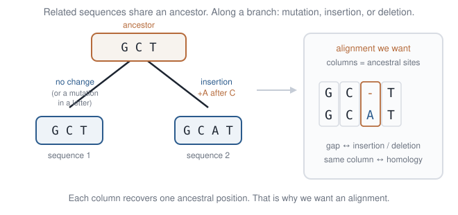{.sketch}

::: {.takeaway}
An **alignment** recovers that shared history: each column is one ancestral position. Without it we cannot tell a real mutation from a shifted letter.
:::

## Correspondence lives on a grid

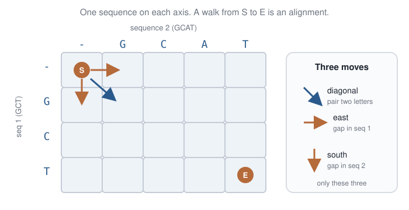{.sketch}

::: {.takeaway}
Diagonal = pair two letters. East or south = a gap in one string.
:::

## One path, one alignment

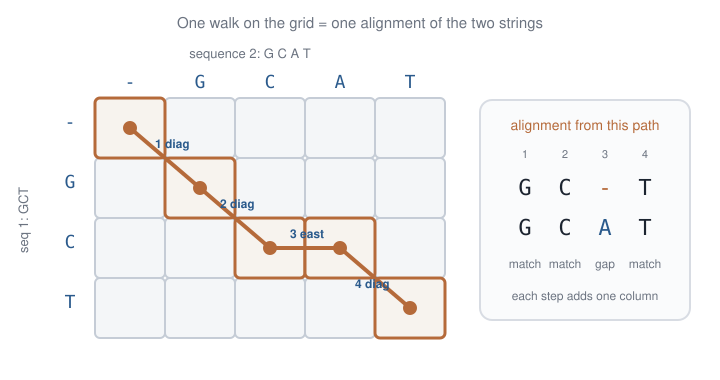{.sketch}

::: {.takeaway}
Input: two related sequences. Output: a path that says which letters correspond.
:::

## Different paths, different alignments

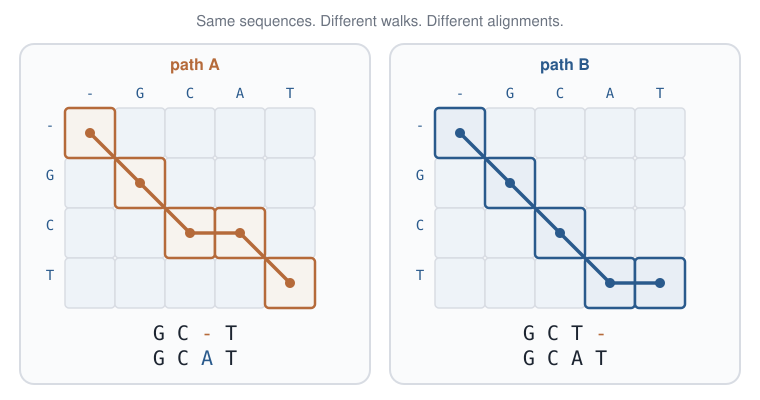{.sketch}

::: {.takeaway}
Many legal alignments. Once the edges have scores, we will want the highest-scoring one.
:::

## The same grid, with numbers {.section-head}

Letters make the scores biological. First practise on a city whose streets are plain numbers you can add by hand.

## South and east only

Start at the **hotel** (top-left). End at the **cafe** (bottom-right). One-way streets: only **south** or **east**. Each street has a score.

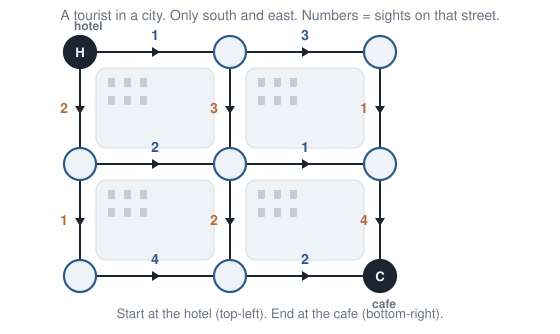{.sketch}

## A walk is a sum

Add the numbers on the streets you use.

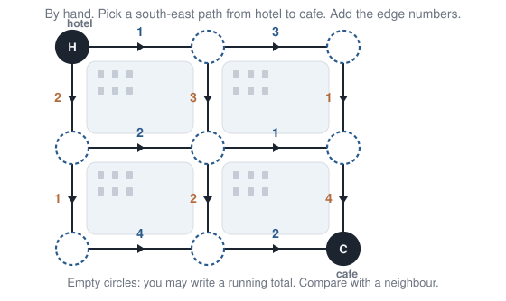{.sketch}

## Input / output

::: {.io}
::: {.in}
**Input**

An $n \times m$ grid of steps; a score on every south edge and every east edge.
:::
::: {.arrow}
→
:::
::: {.out}
**Output**

A highest-scoring hotel-to-cafe walk, and its score.
:::
:::

## Today's toy

::: {.toy}
**Toy.** The city above: two steps south and two steps east. Lab: the same numbers in `labs/03-tourist.ipynb`.
:::

## Why the number of walks is a binomial

To reach a cafe that is $n$ steps south and $m$ steps east, every legal walk uses **exactly** $n$ south steps and $m$ east steps, in some order.

Choose which $n$ of the $n+m$ steps are south. The rest are east:

$$
\binom{n+m}{n}.
$$

A string of moves with the wrong counts leaves the city, so the count is not $2^{n+m}$.

On today's city, $n=m=2$:

$$
\binom{4}{2} = 6.
$$

## The six walks

::: {.small}
| Walk | Edges | Score |
|:-----|:------|-----:|
| EESS | $1+3+1+4$ | 9 |
| ESES | $1+3+1+4$ | 9 |
| ESSE | $1+3+2+2$ | 8 |
| SEES | $2+2+1+4$ | 9 |
| SESE | $2+2+2+2$ | 8 |
| SSEE | $2+1+4+2$ | 9 |
:::

Four walks score $9$. Two score $8$.

## Listing does not scale

For $n=m=20$ the same count is

$$
\binom{40}{20} \approx 1.4 \times 10^{11}
$$

walks. That is last week’s TSP again: finitely many, too many to list.

## Greedy does not work

At each corner, take the higher street leaving it. On this city that walk is `SESE`, and it scores $8$.

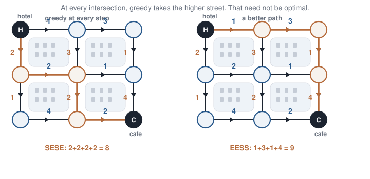{.sketch}

::: {.takeaway}
`SESE` is legal and locally best. Four other walks score $9$.
:::

## Shared prefixes

Several of those six walks pass through the same corner. Listing each walk re-adds the best way to get there.

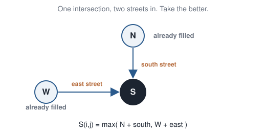{.sketch}

## Same disease as Fibonacci

Naive Fibonacci recomputed $F_3$ on every branch. Listing walks recomputes “best score to this corner.”

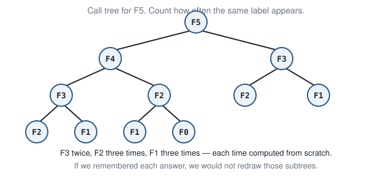{.sketch}

## Quiz

We only want the **cafe**. The walks share prefixes.

::: {.q}
What should you store, so that the best way into a corner is computed only once?
:::

## Answer

::: {.cards}
::: {.card}
**Fibonacci**

Want $F_n$. Store every $F_k$.
:::
::: {.card .warm}
**City**

Want the cafe. Store the best walk from the hotel to **every** corner.
:::
:::

The cafe is one of those corners.

::: {.idea}
**Dynamic programming:** solve a more general family of overlapping subproblems — here, the best score from the hotel to every cell — then read off the cafe.
:::

## The edges are easy

Along the top there is only east. Along the left side there is only south. One predecessor, so the sum is forced.

$$
S(0,0)=0,\;
S(0,1)=1,\;
S(0,2)=4,\qquad
S(1,0)=2,\;
S(2,0)=3
$$

$S(i,j)$ is the best score of a walk from the hotel to cell $(i,j)$.

## Two neighbours determine the next cell

::: {.split .fig-right}
::: {.pane}
Cell $(1,1)$ has both neighbours filled.

- from the north: $1 + 3 = 4$
- from the west: $2 + 2 = 4$

$$
S(1,1) = \max(4,4) = 4
$$

A tie: either pointer is a best way into this cell.
:::
::: {.pane}
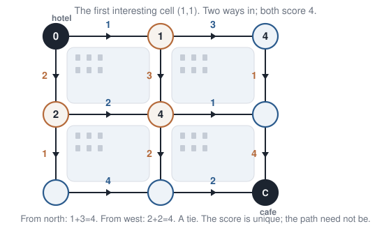{.sketch}
:::
:::

## The recurrence is that rule

Let $s_\downarrow(i,j)$ be the south edge into $(i,j)$, and $s_\rightarrow(i,j)$ the east edge.

$$
\begin{aligned}
S(0,0) &= 0 \\
S(i,0) &= S(i-1,0) + s_\downarrow(i,0) \\
S(0,j) &= S(0,j-1) + s_\rightarrow(0,j) \\
S(i,j) &= \max\bigl(
  S(i-1,j) + s_\downarrow(i,j),\;
  S(i,j-1) + s_\rightarrow(i,j)
\bigr)
\end{aligned}
$$

Store a pointer $D(i,j)$: which neighbour won.

## Fill left to right, top to bottom

Use that order so that, when you reach a cell, the north neighbour and the west neighbour are already numbers.

::: {.small}
| Cell | North | West | $S$ |
|:-----|------:|-----:|----:|
| $(1,2)$ | $5$ | $5$ | 5 |
| $(2,1)$ | $6$ | $7$ | **7** (west) |
| $(2,2)$ | $9$ | $9$ | **9** |
:::

## The cafe scores $9$

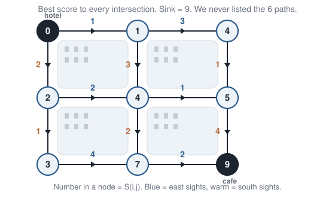{.sketch}

The bottom-right cell is $9$. That is the best hotel-to-cafe score.

## One cell per corner

The table has one entry per intersection.

$$
T(n,m) = O(nm)
$$

For $20\times 20$ steps that is $21\times 21$ cells, not $\binom{40}{20}$ walks.

## Traceback

::: {.split .fig-right}
::: {.pane}
Follow the pointers from the cafe back to the hotel. One best walk, west into the cafe:

$$
(0,0)\to(1,0)\to(2,0)\to(2,1)\to(2,2)
$$

Score $2+1+4+2=9$. The score is unique. A tie means more than one walk attains it.
:::
::: {.pane}
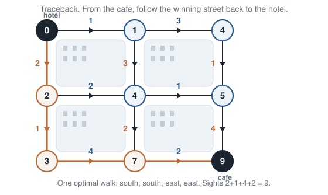{.sketch}
:::
:::

## Pseudocode

::: {.small}
```python
S[0][0] = 0
for i in range(1, n):
    S[i][0] = S[i - 1][0] + south[i][0]
for j in range(1, m):
    S[0][j] = S[0][j - 1] + east[0][j]
for i in range(1, n):
    for j in range(1, m):
        a = S[i - 1][j] + south[i][j]
        b = S[i][j - 1] + east[i][j]
        S[i][j] = max(a, b)
        D[i][j] = "N" if a >= b else "W"
```
:::

Then walk $D$ from the cafe back to the hotel.

## A closed cell

If one intersection is closed, no walk may enter it. Put $\mathrm{NA}$ there and drop every move that would land on it. The other neighbour still competes. Keep sweeping.

::: {.takeaway}
A closed cell stays in the table. The recurrence uses whichever predecessors remain.
:::

## Open `labs/03-tourist.ipynb`

::: {.lab}
::: {.lab-tag}
Lab · ~20 minutes · Python + matplotlib
:::

1. Draw the city. Run the **greedy** walker — score should be $8$.
2. Watch the **DP fill** redraw; sink $=9$. Traceback the path on the plot.
3. Compare greedy vs DP. Glance at $\binom{40}{20}$ vs $400$ cells.
:::

Change an edge weight and re-run. The recurrence is: best of north-plus-south-edge and west-plus-east-edge.

## Global alignment {.section-head}

Same sweep as the tourist. The axes are two strings, and we want the **whole** of both.

## Cytochrome *c*

Cells make ATP in the mitochondrion. **Cytochrome *c*** is the small protein that carries the electrons for that reaction. Without it, the cell cannot respire.

Yeast, horse, and human all have this protein, and it does the same job in each of them. One chain, about 104 amino acids, from the first residue to the last.

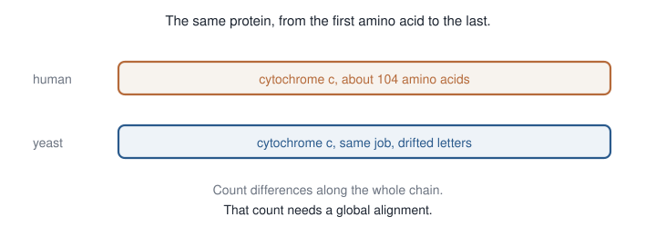{.sketch}

## The differences are a clock

In the 1960s this was one of the first proteins sequenced in many species, because the chain is short. Count the amino acids that differ:

::: {.small}
| Pair | Differences |
|:-----|------------:|
| human vs chimpanzee | 0 |
| human vs rhesus macaque | 1 |
| human vs horse | 12 |
| human vs baker's yeast | about 45 |
:::

A larger count means a longer time since the two species split. That count is a **molecular clock**.

## Only the whole chain dates the split

The amino acids that hold the electron barely change, in a horse or in yeast. A search that keeps only that similar patch scores horse and yeast almost the same, and throws away the sites that separate them.

Those changed sites are the clock. They are counted only when every column of both proteins is in the alignment. That is global alignment.

## Three moves

::: {.split .fig-right}
::: {.pane}
The tourist had two moves. Alignment adds a **diagonal**.

- **Diagonal:** align $v_i$ with $w_j$ — add $\sigma(v_i, w_j)$
- **Down:** a gap in $w$ — add the gap penalty
- **Right:** a gap in $v$ — add the gap penalty

$\sigma(a,b)$ is the number for one column. On the board: $+1$ match, $-1$ mismatch, $-1$ gap.
:::
::: {.pane}
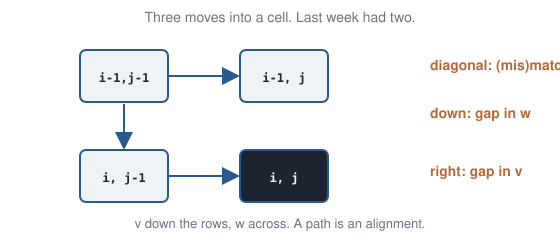{.sketch}
:::
:::

## Input / output

::: {.io}
::: {.in}
**Input**

Strings $v,w$; a score $\sigma(a,b)$ for every letter pair; a gap penalty.
:::
::: {.arrow}
→
:::
::: {.out}
**Output**

A highest-scoring alignment of the whole of $v$ with the whole of $w$, and its score.
:::
:::

## Today's toy

::: {.toy}
**Toy.** `GCT` vs `GCAT`. Match $+1$, mismatch or gap $-1$. Lab: `labs/04-nw.ipynb`.
:::

## Score two alignments by hand

```
G-CT          GC-T
GCAT          GCAT
```

$+1$ for a match, $-1$ for a mismatch or a gap. Which alignment wins?

## The winner scores $+2$

::: {.small}
| Column | Score |
|:-------|------:|
| match | $+1$ |
| mismatch | $-1$ |
| gap | $-1$ |
:::

```
G C - T     +1 +1 -1 +1 = +2
G C A T
```

The other alignment pays for a gap and a mismatch. A different $\sigma$ can change the winner. The sweep stays the same.

## The borders are a gap tax

The first row and the first column align a prefix against nothing: one gap per step.

::: {.small}
|  | - | G | C | A | T |
|--:|--:|--:|--:|--:|--:|
| **−** | 0 | −1 | −2 | −3 | −4 |
| **G** | −1 |  |  |  |  |
| **C** | −2 |  |  |  |  |
| **T** | −3 |  |  |  |  |
:::

$S(i,0) = -i$ and $S(0,j) = -j$. Same idea as the hotel's top row and left column: only one way in.

## One cell, three neighbours

$S(1,1)$ is G against G. All three neighbours are known.

- diagonal: $0 + \sigma(\mathrm{G},\mathrm{G}) = 0 + 1 = 1$
- from above (gap in `GCAT`): $-1 + (-1) = -2$
- from the left (gap in `GCT`): $-1 + (-1) = -2$

The diagonal wins: $S(1,1) = 1$.

## The recurrence is that rule

$S(i,j)$ is the best score for the prefixes $v[1..i]$ and $w[1..j]$.

$$
\begin{aligned}
S(i,0) &= -i,\quad S(0,j)=-j \\
S(i,j) &= \max
\begin{cases}
S(i-1,j-1)+\sigma(v_i,w_j)\\
S(i-1,j)-1\\
S(i,j-1)-1
\end{cases}
\end{aligned}
$$

Diagonal: the cell up-and-left, plus the score for this letter pair. From above: a gap in $w$. From the left: a gap in $v$.

## Sweep the rest of the table

Left to right, top to bottom, so all three neighbours are already filled.

::: {.small}
|  | - | G | C | A | T |
|--:|--:|--:|--:|--:|--:|
| **−** | 0 | −1 | −2 | −3 | −4 |
| **G** | −1 | **1** | 0 | −1 | −2 |
| **C** | −2 | 0 | **2** | 1 | 0 |
| **T** | −3 | −1 | 1 | 1 | **2** |
:::

The corner is $2$. That is the score of a best global alignment.

## Traceback from the corner

::: {.split .fig-right}
::: {.pane}
From $S(3,4)$ back to $S(0,0)$:

diagonal T–T, left (a gap opposite A), diagonal C–C, diagonal G–G.

```
G C - T
G C A T
```

Needleman–Wunsch: sweep every cell; traceback from the far corner.
:::
::: {.pane}
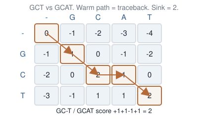{.sketch}
:::
:::

## Pseudocode

::: {.small}
```python
S[0][0] = 0
for i in range(1, n + 1):
    S[i][0] = -i
for j in range(1, m + 1):
    S[0][j] = -j
for i in range(1, n + 1):
    for j in range(1, m + 1):
        diag = S[i - 1][j - 1] + sigma(v[i - 1], w[j - 1])
        up   = S[i - 1][j] - GAP
        left = S[i][j - 1] - GAP
        S[i][j] = max(diag, up, left)
```
:::

Then traceback from the far corner.

## Complexity

$n \times m$ cells, a constant amount of work in each.

$$
T(n,m) = O(nm)
$$

Two genes of $10\,\mathrm{kb}$: about $10^8$ cells. Two chromosomes of $10^8$ letters: $10^{16}$ cells — later weeks build an index.

## Memory

The table is $O(nm)$ memory. The **score** alone needs only the previous row: $O(\min(n,m))$. Recovering the path is what stores the pointers.

## Why $\pm 1$ is a toy

Match $+1$ only rewards identical letters. Leucine and isoleucine have almost the same side chain, so pairing them should score better than pairing leucine with tryptophan. The table that supplies that number is built from real columns, not from a flat $+1$.

## What a column counts

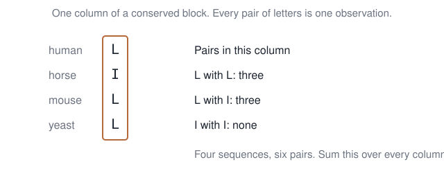{.sketch}

A **conserved block** is a stretch already lined up across related proteins — the part of cytochrome *c* that holds the electron is one. In each column, every pair of amino acids is one observation.

Sequences more than 62% identical are merged into a single count, so a big family of nearly the same protein is not counted once per copy. The table from that rule is **BLOSUM62**. The 62 is the cutoff. Steven Henikoff and Jorja Henikoff published it in 1992.

## The entry compares the pair with chance

Let $q$ be the fraction of observed pairs that are this amino-acid pair. Let $f$ be the fraction expected if the two letters were chosen independently, each with its own frequency.

$$
\sigma = 2\,\log_2(q / f),
$$

rounded to an integer. The factor $2$ is the unit of the published table. Positive: the pair is seen more often than chance. Negative: less often. In BLOSUM62, leucine with isoleucine is $+2$. Leucine with alanine is $-1$. Leucine with leucine is $+4$.

An earlier table counts a different experiment. An **accepted point mutation** is a replacement still seen in proteins that are almost unchanged. Margaret Dayhoff (1978) counted those, then raised the short-time table to a power to stand for a longer time. That matrix is called PAM. BLOSUM62 does not extrapolate: it counts the pairs in the blocks themselves.

## The diagonal adds that entry

::: {.split .fig-right}
::: {.pane}
On a diagonal step, add $\sigma(v_i, w_j)$ from the table. A leucine–isoleucine step that scored $-1$ under the toy now scores $+2$.

The three neighbours, and the left-to-right sweep, stay the same. The winning arrow can change. Today's board still uses $+1$ and $-1$.
:::
::: {.pane}
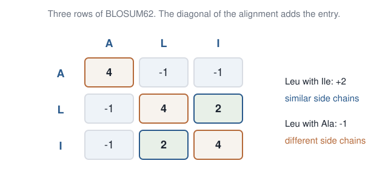{.sketch}
:::
:::

## DNA: transitions vs transversions

::: {.split .fig-right}
::: {.pane}
In DNA, C changing into T is common. C changing into A is rarer. A useful score charges less for the common change.

Same two strings, different $\sigma$, and the winning path can change. Today's board stays $+1$ and $-1$.
:::
::: {.pane}
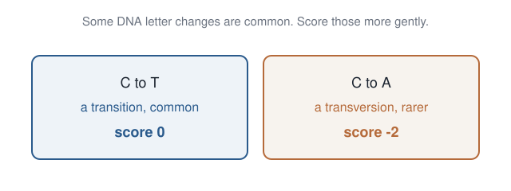{.sketch}
:::
:::

## Local alignment {.section-head}

A Hox protein is not cytochrome *c*. Only a short stretch is shared.

## The homeodomain

**Hox** genes tell an embryo which body part to build: a head segment, a wing, a vertebra. Fly and mouse Hox proteins still share one block of about 60 amino acids, the **homeodomain**. The rest of each protein has drifted.

You recognise a Hox gene by finding that block.

## The shared block

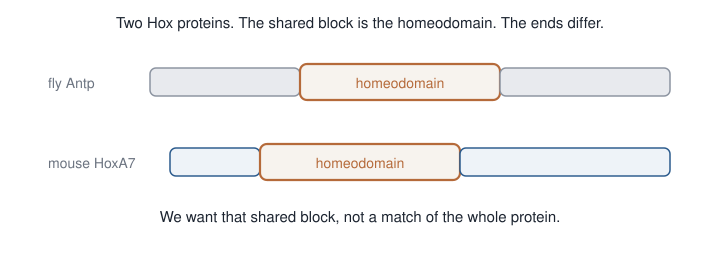{.sketch}

## The homeodomain reads the DNA

DNA is a twisted ladder. Between the turns there is a wide groove, a gap running along the outside. The homeodomain is a short helix that lies in that groove and touches the bases.

That contact is how the protein reads a short DNA word and switches on the genes for one body part. Change those 60 amino acids and the embryo builds the wrong part. The grey ends can drift. This helix cannot.

## The helix lies against the ladder

The coloured ribbons are proteins. The ladder is DNA. The homeodomain is a helix lying in the wide groove, against the bases.

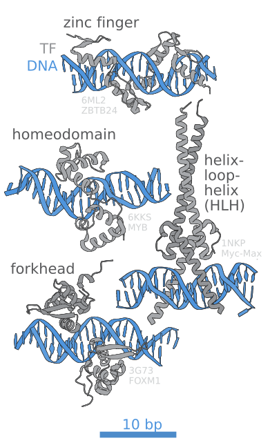{.photo}

::: {.cite}
DNA-binding domains of transcription factors, including the homeodomain. J.J. Froehlich, Wikimedia Commons, [CC BY-SA 4.0](https://creativecommons.org/licenses/by-sa/4.0/). File: Transcription factors DNA binding sites.svg.
:::

## Local alignment adds a zero

Forcing two Hox proteins to match from the first amino acid to the last spends the score on gaps in the grey ends. The question is smaller: which stretch of one protein matches which stretch of the other?

Same three moves, and one extra option in the maximum: $0$. A path that has gone negative is dropped. The best path may start and end in the middle of both strings.

$$
\begin{aligned}
S(i,0) &= 0,\quad S(0,j)=0 \\
S(i,j) &= \max
\begin{cases}
0 \\
S(i-1,j-1) + \sigma(v_i, w_j) \\
S(i-1,j) - 1 \\
S(i,j-1) - 1
\end{cases}
\end{aligned}
$$

## The toy has grey ends

::: {.toy}
**Toy.** `AGCT` against `TGCTAA`. Match $+1$, mismatch or gap $-1$. The shared block is `GCT`. The leading `A` of the first string, and the `T` and `AA` around `GCT` in the second, are the drifted ends.
:::

Temple Smith and Michael Waterman (1981). $S(i,j)$ is the best score of any substring of $v$ ending at $i$ against any substring of $w$ ending at $j$.

## Borders are free

::: {.small}
|  | − | T | G | C | T | A | A |
|--:|--:|--:|--:|--:|--:|--:|--:|
| **−** | 0 | 0 | 0 | 0 | 0 | 0 | 0 |
| **A** | 0 |  |  |  |  |  |  |
| **G** | 0 |  |  |  |  |  |  |
| **C** | 0 |  |  |  |  |  |  |
| **T** | 0 |  |  |  |  |  |  |
:::

Needleman–Wunsch put $-i$ and $-j$ here. Those gap taxes are gone. A match may start at any letter.

## G against G starts from zero

Row `G`, column `G`. The three neighbours are the border.

- diagonal: $0 + 1 = 1$
- from above: $0 - 1 = -1$
- from the left: $0 - 1 = -1$

$$
S = \max(0, 1, -1, -1) = 1.
$$

Needleman–Wunsch, on the same letters, inherits the border $-1$, so its diagonal is $-1+1=0$. The extra $0$ in the maximum is why this cell is $1$ rather than $0$.

## A bad step is not stored

The next cell is `G` against `C`.

- diagonal: $0 + (-1) = -1$
- from above: $0 - 1 = -1$
- from the left: $1 - 1 = 0$

$$
S = \max(0, -1, -1, 0) = 0.
$$

Needleman–Wunsch stores $-1$ in this cell. The local cell writes $0$ and forgets the path. Later letters do not inherit a debt.

## C against C adds the match

The diagonal neighbour is the `G`/`G` cell, which holds $1$.

- diagonal: $1 + 1 = 2$
- from above: $0 - 1 = -1$
- from the left: $0 - 1 = -1$

$$
S = 2.
$$

The pointer is the diagonal. The score so far is `GC` against `GC`.

## The two neighbours of the last match

Before the last `T`, two cells are still open.

`C` against `T` (the cell that will sit above the last match):

- diagonal: $0 + (-1) = -1$
- from above: $0 - 1 = -1$
- from the left, which holds the `C`/`C` score $2$: $2 - 1 = 1$

That cell is $1$.

`T` against `C` (the cell that will sit to the left):

- from above, again the `C`/`C` score: $2 - 1 = 1$
- diagonal and from the left are $-1$

That cell is $1$ as well.

## T against T

The diagonal neighbour is `C` against `C`, score $2$. The cell above, `C` against `T`, is $1$. The cell to the left, `T` against `C`, is $1$.

- diagonal: $2 + 1 = 3$
- from above: $1 - 1 = 0$
- from the left: $1 - 1 = 0$

$$
S = 3.
$$

Needleman–Wunsch stores $2$ for this same pair of letters. It still carries the opening `A` against `T`, score $-1$. Smith–Waterman discarded that opening when it wrote $0$, so the $3$ does not contain it.

## The finished table

::: {.small}
|  | − | T | G | C | T | A | A |
|--:|--:|--:|--:|--:|--:|--:|--:|
| **−** | 0 | 0 | 0 | 0 | 0 | 0 | 0 |
| **A** | 0 | 0 | 0 | 0 | 0 | 1 | 1 |
| **G** | 0 | 0 | **1** | 0 | 0 | 0 | 0 |
| **C** | 0 | 0 | 0 | **2** | 1 | 0 | 0 |
| **T** | 0 | 1 | 0 | 1 | **3** | 2 | 1 |
:::

The largest entry is $3$. Two other islands are positive and smaller: the final `A` against `A` scores $1$, and the first `T` against `T` scores $1$.

## Traceback stops at zero

Start at $3$. Each pointer is the diagonal.

$$
3 \rightarrow 2 \rightarrow 1 \rightarrow 0.
$$

Stop on the $0$. The letters used are

```
G C T
G C T
```

score $+1+1+1=3$. The leading `A` of the query and the `T` and `AA` around the database block are not on the path.

## Global still pays for the ends

Needleman–Wunsch must use every letter. Its far corner is $0$:

```
A G C T - -
T G C T A A
```

$-1+1+1+1-1-1=0$. The same `GCT`, plus a mismatch and two gaps. Local score $3$, global score $0$.

::: {.takeaway}
On `AGCT` against `TGCTAA`, the zero makes the `GCT` cell $3$ instead of $2$, and traceback stops at $0$.
:::

## Finding that domain in a database

A homeodomain against every protein is one Smith–Waterman table per protein. Most cells are the grey ends.

BLAST looks up a short word that already occurs in both strings — on the toy, `GC` — then fills the zero-floor table only around that hit. The leading `T` and the trailing `AA` are never computed. Stephen Altschul and colleagues (1990).

::: {.takeaway}
BLAST looks up a word, then runs Smith–Waterman only near that seed.
:::

## 90 seconds: global vs local

Yeast cytochrome *c* against human cytochrome *c*. A Hox protein against another Hox protein. Which alignment, and why?

## Open `labs/04-nw.ipynb`

::: {.lab}
::: {.lab-tag}
Lab · ~20 minutes · Python
:::

1. Run Needleman–Wunsch with knobs `MATCH` / `MISMATCH` / `GAP`. Check the corner $=2$; print the traceback alignment.
2. Change the knobs — does the path change?
3. Smith–Waterman on `AGCT` against `TGCTAA`. The largest entry is $3$, and the path is `GCT`/`GCT`.
:::

Name the three moves without looking.

## A bit of history

::: {.history .small}
- **Bellman** (1950s): dynamic programming — a table of overlapping subproblems.
- **Needleman & Wunsch** (1970): global alignment as this grid.
- **Smith & Waterman** (1981): local alignment — add $0$.
- **Altschul et al.** (1990): BLAST — look up a short word, then align only near that hit.
- **Dayhoff** (1978): PAM, from replacements in nearly identical proteins.
- **Henikoff & Henikoff** (1992): BLOSUM62, pairs counted in conserved blocks.
:::

## Tools that use this

::: {.tools .small}
- **EMBOSS** `needle` / `water`: exact Needleman–Wunsch and Smith–Waterman.
- **BLAST**, **DIAMOND**: seed a short word, then extend locally.
- Next week: Hirschberg (linear memory), RNA folding, Viterbi.
:::

## Takeaway / Questions

::: {.muted}
Without notes. One sentence each.
:::

::: {.qs}
::: {.q}
[Q1]{.tag} Why is $\binom{n+m}{n}$ the number of south–east walks, and why is filling $S$ cheaper?
:::
::: {.q}
[Q2]{.tag} The three alignment moves, in words. What does changing $\sigma$ change — the sweep, or the winning path?
:::
::: {.q .q3}
[Q3]{.tag} We only want the cafe (or only $F_n$). Why does the table still hold a value for every cell (every $F_k$)?
:::
:::

::: {.takeaway}
The cafe is one cell. We fill the others because walks share prefixes.
:::

## Takeaways

::: {.takeaway}
South–east walks: choose $n$ positions out of $n+m$ for the south steps. Greedy can score $8$ when the best is $9$.
:::

::: {.takeaway}
Fill edges first, then each cell from its neighbours, left to right and top to bottom. Traceback reads off the walk.
:::

::: {.takeaway}
On `AGCT` against `TGCTAA`, Smith–Waterman scores `GCT`/`GCT` as $3$ and stops at $0$. BLAST looks up a short word and fills only near that seed.
:::

## Next week

**DP variants:** Hirschberg (same alignment, linear memory by splitting the table in half), RNA folding (Nussinov), and Viterbi on an HMM.

## To read

::: {.read}
- Bellman (1957). *Dynamic Programming*.
- Needleman & Wunsch (1970). *J. Mol. Biol.*
- Smith & Waterman (1981). *J. Mol. Biol.*
- Altschul et al. (1990). *J. Mol. Biol.* — BLAST.
- Kleinberg & Tardos, *Algorithm Design*, ch. 6.
- Henikoff & Henikoff (1992). *Proc. Natl. Acad. Sci.* — BLOSUM.
- Durbin et al., *Biological Sequence Analysis* — scoring as a model.
:::
